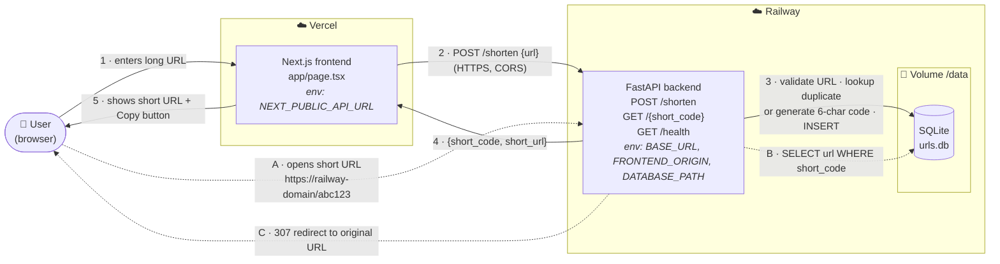

# Lab 1 — Implementation Plan

Based on [Lab1_URL_Shortener.md](Lab1_URL_Shortener.md). Time budget: 1h15.

## End-to-end architecture



Solid arrows: shortening flow. Dotted arrows: redirect flow (the short URL points directly at the backend; the frontend is not involved).

## Target structure

```
Lab_module1/
├── Lab1_URL_Shortener.md
├── PLAN.md
├── backend/                  # Python FastAPI → Railway
│   ├── app/
│   │   ├── main.py           # FastAPI app, routes, CORS
│   │   ├── db.py             # SQLite connection + table setup
│   │   └── shortener.py      # 6-char code generation, URL lookup
│   ├── tests/
│   │   └── test_api.py       # pytest + FastAPI TestClient
│   ├── requirements.txt
│   └── railway.json          # start command + health check for Railway
└── frontend/                 # Next.js (TypeScript) → Vercel
    ├── app/page.tsx          # the single page
    ├── .env.local            # NEXT_PUBLIC_API_URL=http://localhost:8000
    └── package.json
```

## Phase 0 — Prerequisites (5 min)

- [ ] Switch to Node 24 (`nvm use 24`, already installed). Next.js 16 requires Node ≥ 20.9 and Vitest 5 requires ≥ 22.12; the current default is 18.18.
- [ ] Create the external accounts (see "External tasks" below).

## Phase 1 — Backend (25 min)

Detailed plan with code and test cases: [BACKEND_PLAN.md](BACKEND_PLAN.md).

- [ ] `POST /shorten` — body `{"url": "..."}`, returns `{"short_code", "short_url"}`
  - URL validation with Pydantic `HttpUrl` (http/https only) → 422 on invalid input
  - Duplicate URL → return the existing code (UNIQUE index on `url`)
  - Code: 6 random chars from `[A-Za-z0-9]` (`secrets.choice`), retry on collision
  - `short_url` = `BASE_URL` env var + `/` + code (default `http://localhost:8000`)
- [ ] `GET /{short_code}` — 307 redirect to original URL, 404 if unknown
- [ ] SQLite table `urls(id, short_code UNIQUE, url UNIQUE, created_at)`; DB path from `DATABASE_PATH` env var
- [ ] CORS: allow the frontend origin from `FRONTEND_ORIGIN` env var
- [ ] `GET /health` for the deploy platform
- [ ] Tests (pytest): create, duplicate returns same code, invalid URL rejected, redirect works, unknown code 404, code format is 6 alphanumerics
- [ ] ✅ Deliverable: *backend running locally and tests passing*

## Phase 2 — Frontend (20 min)

Detailed plan with code and test cases: [FRONTEND_PLAN.md](FRONTEND_PLAN.md).

- [ ] `create-next-app` with TypeScript + Tailwind
- [ ] Single page: URL input + "Shorten" button
- [ ] Calls `${NEXT_PUBLIC_API_URL}/shorten`
- [ ] Loading state (disabled button + spinner) during the call
- [ ] Result box with short URL + "Copy" button (Clipboard API, "Copied!" feedback)
- [ ] Error messages: invalid URL (422), backend unreachable, other errors
- [ ] Responsive layout (mobile-first, Tailwind)
- [ ] ✅ Deliverable: *frontend running locally and connecting to backend*

## Phase 3 — Deploy (20 min)

Backend first, because the frontend needs its URL.

1. [ ] **Railway (backend)**
   - `railway login` → `railway init` → `railway up` from `backend/`
   - Add a **Volume** mounted at `/data`, set `DATABASE_PATH=/data/urls.db` (without it, SQLite is wiped on every redeploy)
   - Generate a public domain; set `BASE_URL=https://<railway-domain>`
2. [ ] **Vercel (frontend)**
   - `vercel login` → `vercel` from `frontend/`
   - Set `NEXT_PUBLIC_API_URL=https://<railway-domain>`, then `vercel --prod`
3. [ ] Back on Railway: set `FRONTEND_ORIGIN=https://<vercel-domain>` (CORS)
4. [ ] ✅ Deliverables: *backend deployed*, *frontend deployed*, *end-to-end works*

## Phase 4 — Extensions (if time permits)

Ordered by effort: Analytics (click counter column) → Custom codes → Expiration → QR codes.

## Phase 5 — Reflection

Answer the 4 reflection questions in the lab file.

## Phase 6 — Backend quality review

SOLID, DDD, RFC 9457 error handling and SQL-injection hardening: [BACKEND_REVIEW_PLAN.md](BACKEND_REVIEW_PLAN.md).

## External tasks (must be done by you)

| # | Task | Cost | Needed for |
|---|------|------|-----------|
| 1 | Create a **Vercel** account (vercel.com — sign up with GitHub is easiest) | Free (Hobby plan) | Frontend deploy |
| 2 | Create a **Railway** account (railway.com) | Trial credit, then paid (~US$5/month Hobby) — check current pricing | Backend deploy |
| 3 | Log in to the CLIs in your terminal: `vercel login`, `railway login` (opens the browser) | — | Deploy commands |
| 4 | *(Optional)* Fix GitHub CLI login: `gh auth login` — current token is invalid | Free | Only if you want to push the code to GitHub or deploy via Git integration |

Free alternative to Railway ("or similar"): **Render** free web service — no cost, but it sleeps when idle (first request takes ~30–60s) and its disk is not persistent, so SQLite data is lost on restart. Fine for the lab demo.
